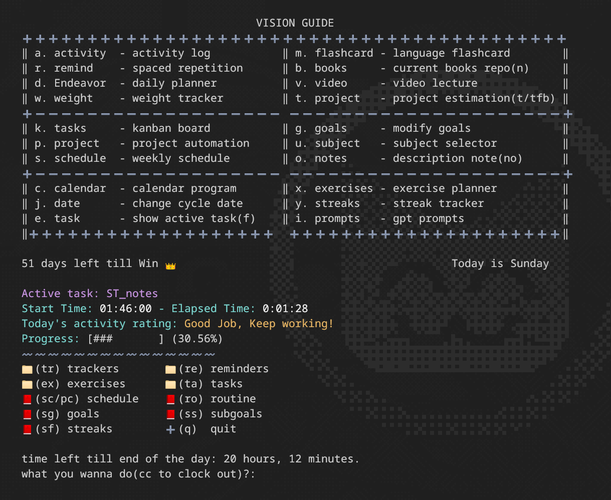

# Study Planner and Tracker

**Study Planner and Tracker** is a versatile personal productivity tool designed to streamline your study routines, exercise plans, and exam preparation. Built as a modification of another repository, this project empowers you to take control of your daily tasks and learning progress with a wide array of features.

## Key Features

- **Activity Tracker:** Visualize your progress with a GitHub-like heat-map coloring system. You can manually select or let the system automatically assign colors based on your routine plan. 🟩🟥

- **Daily Routine Planner (Endeavor):** Set and manage daily tasks, categorizing them with specific tags to keep your work organized. Tasks reset daily to help you maintain a structured routine. ♻️

- **Reminders:** Implement spaced repetition techniques to schedule tasks for repetition at intervals of 1, 3, 7, 12, or 22 days. 🔄

- **Anki-style Flashcards with Multiple Dictionary Support:** Enhance your learning experience with a CLI Anki-like flashcard program. Customize levels, and watch as they advance as you reach a score of 10. Ideal for language learning and medical students. 📚💼

- **Book, Note, and Video Lecture Tracker:** Keep track of your educational resources, aiding in project estimations and progress tracking. 📚🗒️📺

- **Project Estimation:** The heart of the program - a sorting algorithm for tasks, exercises and free planners. It uses due date for each tracker and its workload to prioritize your tasks efficiently so you only focus on few trackers at a time. 🗂️⏳

- **Goal Tracker:** Set, track, and achieve your goals effectively. 🎯

- **Subject Database:** Maintain records of your coursework, course selection, and more. 📖

- **Kanban Board for Tasks:** Streamline your task management with a Kanban-style board. 📌

- **Weekly Schedule:** Plan your courses and commitments effortlessly. 🗓️

- **Calendar:** A CLI calendar for event management. While it lacks phone notifications, it provides quick reference to upcoming events. 📆

- **Exercise Planner:** Tailored for fitness enthusiasts, this feature helps you plan your exercise routines. 💪

- **Weight Tracker:** Monitor your physical health with a built-in weight tracking feature. ⚖️

- **Project Planner:** A dedicated planner for managing projects. 🗂️

- **End of the Day Counter:** Keep tabs on your daily accomplishments. 🌆

- **Optional Integration:** You can seamlessly integrate [goforitgnome](https://github.com/Manuel-Kehl/Go-For-It) for dynamic task management.

~~don't forget to add activity before sleep, otherwise your day will be saved to red!~~

## Installation

1. Ensure you have the required dependencies listed in `requirements.txt`.
2. Run `guide.py` to set up the application.

    for windows users you need to run in terminal (powershell works, haven't tested cmd. you can install windows terminal) and give admin privileges.

## Caution

- The exercise planner generates a template that requires manual editing.

## To-Do

- [x] Cleanup the repository and organize files.

- [x] Create a user configuration folder (manually add it to `.zshrc`).

- [x] Enable tasks to be added to project estimation exercises.

- [x] Implement task description notes for tasks, trackers, and reminders.

- [ ] Add a pie graph for day/work time/productivity over time.

- [x] Implement subgoals for goals and display active subgoals (e.g., 1/n, displaying the first checked subgoal instead of the main goal).

- [ ] Refactor and improve code quality (Do NOT READ).
